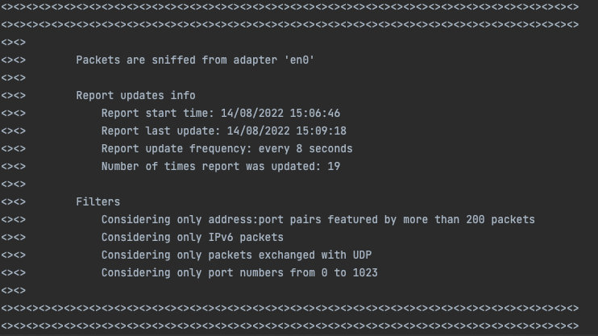
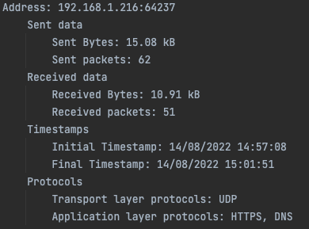
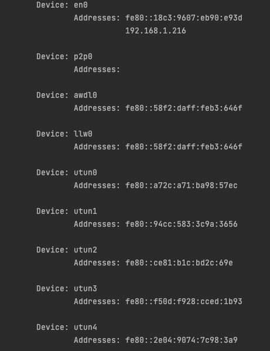
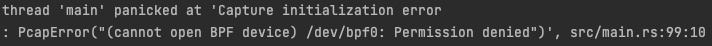

# Sniffnet (network packets sniffer)

<details>
  <summary>Table of contents</summary>

- [Introduction](#introduction)

- [User interactions during application execution](#user-interactions-during-application-execution)

- [Textual report structure](#textual-report-structure)
  + [Report header](#report-header)
  + [Report address:port list](#report-addresses-list)
  
- [Implementation details](#implementation-details)
  
- [Error conditions](#error-conditions)
  + [Wrong command line options specification](#wrong-command-line-options-specification)
  + [Permissions errors](#permissions-errors)
  + [Windows configuration problems](#windows-configuration-problems)
  + [Other errors](#other-errors)

- [Authors](#authors)
  
</details>
  
 
## Introduction

Aim of the application is to intercept incoming and outgoing traffic through a user specified network interface of a computer.

The application will periodically generate and update a [human-readable textual report](#textual-report-structure), providing statistics about the observed network packets.

There are several command line options that can be specified to select the network adapter to inspect, to set a desired textual report update frequency and to specify filters on the observed network traffic. You can find a list of the available options in the code documentation.

The application can be run using ```cargo run``` or ```cargo run -- [OPTIONS]```.

In this document you can find a description of the available user actions during program execution, the interpretation of the report file structure, some implementation details from an algorithmic point of view, an explanation of the possible error conditions that may occur, and other useful information.

          
## User interactions during application execution

The user can interact with the sniffing process through the terminal window.

- **Pause**: to temporarily pause the sniffing process, the user can type a 'p' character in the terminal window.

- **Resume**: to later resume the sniffing process, the user can type a 'r' character in the terminal window.

- **Stop**: to stop the application execution, the user can type a 's' character in the terminal window.


## Textual report structure

In this section is reported the structure of the output report file generated, to help the users better understand and interpret it.

### Report header

The first section of the textual report contains a header summarizing different useful information.



First, it specifies the name of the network adapter analyzed during the sniffing process.

Then there is a detail about the initial timestamp of the sniffing process, the last timestamp in which the report was updated, the frequency of updates and the number of times the report was updated (re-written from scratch with updated data).

Finally, it describes the status of the possible filters applicable by the user through the command line: minimum number of packets for an address:port pair to be printed in the report, IP address version, transport layer protocol and port minimum and maximum number.

Note that an application layer protocol filter is not provided since the user can use the lowest and highest port options to this purpose (e.g., to filter DNS traffic a user can specify ```packet_sniffer -l 53 -h 53```, to filter HTTPS traffic a user can specify ```packet_sniffer -l 443 -h 443``` and so on).

### Report addresses list

The second section of the textual report is dedicated to the packets stream analysis for each address:port pair.

This analysis results in a list in which each element represents an address:port pair with the relative statistics.

Note that such list of elements is sorted in descending order of ```sent_packets + received_packets```.



For each element it is reported the amount of sent data (relatively to packets in which the address:pair is the source) and received data (relatively to packets in which the address:port is the destination) measured in number of packets and in number of bytes.

For each address:port pair are reported the first and the last timestamp in which a packet was transmitted from/to that address:port.

Level 4 and level 7 carried protocols are also described (respectively transport layer and application layer protocols).

Both the transport layer protocols and application layer protocols fields could report a single or multiple protocols for each address:port pair, based on the traffic type.

Specifically, the transport layer protocols field is based on an Enum with only two values (TCP and UDP), while the application layer protocols field is based on an Enum with some of the most common level 7 protocols (listed in the table below); please note that application level protocols are just inferred from the transport port numbers.

|Port number(s)|Application protocol  |  Description |
|--|--|--|
| 20, 21 | FTP |File Transfer Protocol |
|22|SSH |Secure Shell |
|23|Telnet |Telnet |
|25|SMTP |Simple Mail Transfer Protocol |
|53|DNS |Domain Name System |
|67, 68|DHCP |Dynamic Host Configuration Protocol |
|69|TFTP |Trivial File Transfer Protocol |
|80|HTTP |Hypertext Transfer Protocol |
|110|POP |Post Office Protocol |
|123|NTP |Network Time Protocol |
|137, 138, 139|NetBIOS |NetBIOS |
|143|IMAP |Internet Message Access Protocol |
|161,162|SNMP |Simple Network Management Protocol |
|179|BGP |Border Gateway Protocol |
|389|LDAP |Lightweight Directory Access Protocol |
|443|HTTPS |Hypertext Transfer Protocol over SSL/TLS |
|636|LDAPS |Lightweight Directory Access Protocol over TLS/SSL |
|989, 990|FTPS |File Transfer Protocol over TLS/SSL |


## Implementation details

The application consists in three different execution flows.

The main thread waits for eventual [user actions](#user-interactions-during-application-execution) (by putting the terminal in raw mode through the ```crossterm::screen::raw::into_raw_mode()``` function and creating a ```crossterm::SyncReader``` which allows to read the input synchronously); in doing so it signals to the secondary threads when to pause or resume their work.
The signaling is made possible by setting an application status, shared with the secondary threads and associated to a mutex and a condition variable.

The ```main()``` function, entry point of program execution, generates two secondary threads: one is in charge of waiting for network packets and parsing them, while the other is in charge of updating the textual report every ```interval``` seconds (with ```interval``` defined by the user through the ```-i``` option; if omitted it's equal to 5 seconds).

The thread in charge of parsing packets also insert them into a shared map, where the key part is represented by an ```AddressPort``` struct and the value part is represented by a ```ReportInfo``` struct.
Before parsing each packet it checks the application status: if it is ```Status::Pause``` it waits, otherwise it proceeds parsing the packet.
This thread waits for packets without consuming CPU resources through the ```pcap::Capture::next()``` function.

The thread in charge of updating the textual report sleeps for ```interval``` seconds and re-writes the report with updated traffic statistics.
Before updating the report it checks the application status: if it is ```Status::Pause``` it waits, otherwise it proceeds writing the report.


## Error conditions

In this section are reported the errors that may occur while the application is running.

### Wrong command line options specification


- **Not existing adapter name**

&emsp;&emsp;&emsp; If a non-existing adapter name is provided, the application raises an error and terminates.

&emsp;&emsp;&emsp; In this case the application will suggest using the ```-d``` option to print on the standard output a list of the available devices.

&emsp;&emsp;&emsp; ```packet_sniffer -d``` prints a list of all the available network adapters names and addresses, as in the example that follows.

&emsp;&emsp;&emsp; 


- **Invalid highest port number**

&emsp;&emsp;&emsp; If the provided highest port number is not an integer in the range ```0..=65535``` the program raises an error and terminates.

&emsp;&emsp;&emsp; If also the lowest port number is specified and ```highest_port < lowest_port == true``` the program raises an error and terminates.


- **Invalid interval value**

&emsp;&emsp;&emsp; If the provided interval value is not an integer in the range ```1..=u64::MAX``` the program raises an error and terminates.


- **Invalid lowest port number**

&emsp;&emsp;&emsp; If the provided lowest port number is not an integer in the range ```0..=65535``` the program raises an error and terminates.

&emsp;&emsp;&emsp; If also the highest port number is specified and ```highest_port < lowest_port == true``` the program raises an error and terminates.


- **Invalid minimum packets value**

&emsp;&emsp;&emsp; If the provided minimum packets value is not an integer in the range ```0..=u32::MAX``` the program raises an error and terminates.


- **Invalid network layer protocol filter**

&emsp;&emsp;&emsp; If a string different from "IPv4", "IPv6" or "no filter" is provided (not case-sensitive), the application raises an error and terminates.

&emsp;&emsp;&emsp; Note that not including the ```-n``` option is equal to provide ```-n "no filter"```.


- **Invalid output file extension**

&emsp;&emsp;&emsp; There is no particular limitation on the output file name.

&emsp;&emsp;&emsp; However, if an invalid file extension is provided the file may result unreadable if the extension is not subsequently removed.


- **Invalid transport layer protocol filter**

&emsp;&emsp;&emsp; If a string different from "TCP", "UDP" or "no filter" is provided (not case-sensitive), the application raises an error and terminates.

&emsp;&emsp;&emsp; Note that not including the ```-t``` option is equal to provide ```-t "no filter"```.


### Permissions errors

- **PcapError: Permission denied**

&emsp;&emsp;&emsp; You may incur in this error if you have not the privilege to open a network adapter. Full error is reported below.

&emsp;&emsp;&emsp; 

&emsp;&emsp;&emsp; To solve this error you can execute the following commands:

&emsp;&emsp;&emsp; ```cd /dev```

&emsp;&emsp;&emsp; ```sudo chown <username>:admin bp*```

&emsp;&emsp;&emsp; Where \<username\> can be retrieved with the command ```whoami```.

&emsp;&emsp;&emsp; You will be requested to insert your system password.


### Windows configuration problems

In order to make pcap work properly on Windows systems, it is needed to download the [WinPcap Developer's Pack](https://www.winpcap.org/devel.htm) and to add the ```/Lib``` or ```/Lib/x64``` folder to the ```LIB``` environment variable.


### Other errors

Other errors, not previously listed, may occur seldom.

Most of such errors are due to the unwrapping of ```Result<T>```, which may exceptionally contain the ```Err``` value.
  
This may happen in one of the following situations: activation of a pcap ```Capture``` handle, retrieval of network adapters list through pcap, selection of the default device through pcap, creation of the output file, cloning of the output file handle, acquisition of a ```Mutex``` lock, writing of the output file.
  
All those exceptional scenarios are managed through calls to the ```expect()``` method, providing textual feedback to the user on the cause of the panic.
  
The ```unwrap()``` method is used only on ```Option<T>``` values when it's certain they contain ```Some``` value.


# Authors

- [Bellini Giuliano](https://github.com/GyulyVGC)
- [Canepari Cristiano Marco](https://github.com/Crirock)
