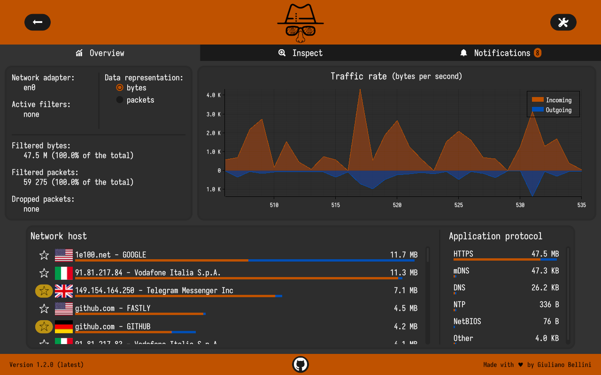
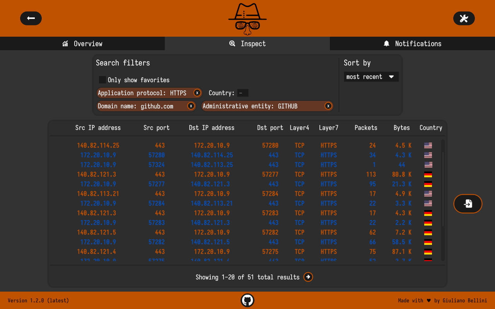
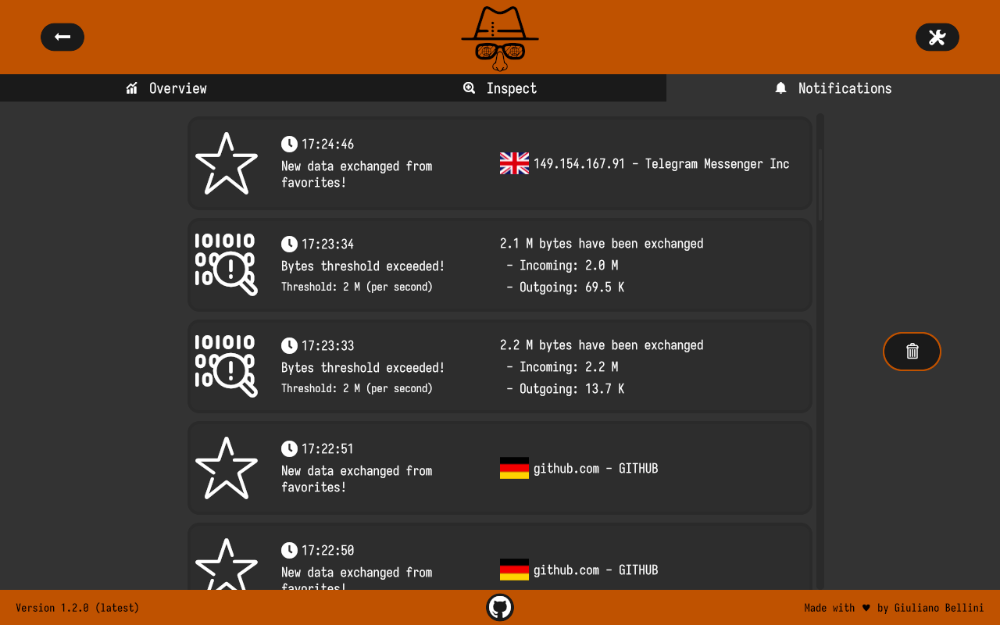

<div align="center">
<a href="https://www.sniffnet.net"></a>

<a href="#download"></a>
<a href="https://github.com/GyulyVGC/sniffnet/blob/main/ROADMAP.md"></a>
<a href="https://sniffnet.net"></a>
<a href="https://github.com/GyulyVGC/sniffnet/wiki"></a>

Application to comfortably monitor your Internet traffic <br>
Cross-platform, Intuitive, Reliable

Translated in:<br>
🇨🇳 🇩🇪 🇫🇷 🇷🇺 🇵🇹 🇪🇦 🇮🇹 🇵🇱 [+&nbsp;11&nbsp;more&nbsp;languages](https://github.com/GyulyVGC/sniffnet/issues/60)
</div>

<p>
<a href="#x">

</a>
</p>

<div align="center">



</div>

<p>
<a href="#x">

</a>
</p>


## _Support Sniffnet's development_ 💖
<i>
Sniffnet is completely free, open-source software which needs lots of effort and time to develop and maintain.

If you appreciate Sniffnet, [consider sponsoring](https://github.com/sponsors/GyulyVGC):
your support will allow me to dedicate more and more time to this project,
constantly expanding it including [new features and functionalities](https://github.com/GyulyVGC/sniffnet/blob/main/ROADMAP.md).

A special mention goes to these awesome organizations and folks who are sponsoring Sniffnet:
</i>

<p align="center">
<a href="https://github.com/github" title="GitHub"></a>&nbsp;&nbsp;
<a href="https://ipinfo.io" title="IPinfo"></a>&nbsp;&nbsp;
<a href="https://github.com/Cthulu201" title="Cthulu201"></a>&nbsp;&nbsp;
<a href="https://github.com/0x0177b11f" title="Tiansheng Li"></a>&nbsp;&nbsp;
<a href="https://github.com/ZEROF" title="ZEROF"></a>&nbsp;&nbsp;
<a href="https://www.janwalter.org/" title="Jan Walter"></a>
</p>


## Download

> [!NOTE]
>
> If you are unsure which package to download, you should probably choose the first from your operating system list.

|                                                                                                                            |                                                                                                                                       |                                                                                                                                                                                                                                                                                                                             |                                                                                                                         |
|:----------------------------------------------------------------------------------------------------------------------------------------------------------------------------------------------------------:|:-----------------------------------------------------------------------------------------------------------------------------------------------------------------------------------------------------------------:|:------------------------------------------------------------------------------------------------------------------------------------------------------------------------------------------------------------------------------------------------------------------------------------------------------------------------------------------------------------------------------------------------------------------:|:--------------------------------------------------------------------------------------------------------------------------------------------------------------------------------------------------------------:|
| [64-bit](https://github.com/GyulyVGC/sniffnet/releases/latest/download/Sniffnet_Windows_64-bit.msi) \| [32-bit](https://github.com/GyulyVGC/sniffnet/releases/latest/download/Sniffnet_Windows_32-bit.msi) | [Intel](https://github.com/GyulyVGC/sniffnet/releases/latest/download/Sniffnet_macOS_Intel.dmg) \| [Apple silicon](https://github.com/GyulyVGC/sniffnet/releases/latest/download/Sniffnet_macOS_AppleSilicon.dmg) | [amd64](https://github.com/GyulyVGC/sniffnet/releases/latest/download/Sniffnet_LinuxDEB_amd64.deb) \| [arm64](https://github.com/GyulyVGC/sniffnet/releases/latest/download/Sniffnet_LinuxDEB_arm64.deb) \| [i386](https://github.com/GyulyVGC/sniffnet/releases/latest/download/Sniffnet_LinuxDEB_i386.deb) \| [armhf](https://github.com/GyulyVGC/sniffnet/releases/latest/download/Sniffnet_LinuxDEB_armhf.deb) | [x86_64](https://github.com/GyulyVGC/sniffnet/releases/latest/download/Sniffnet_LinuxRPM_x86_64.rpm) \| [aarch64](https://github.com/GyulyVGC/sniffnet/releases/latest/download/Sniffnet_LinuxRPM_aarch64.rpm) |

**Alternative installation methods** are reported in the following:

<details>

  <summary>from Crates.io</summary>

Follow this method only if you have [Rust installed](https://www.rust-lang.org/tools/install) on your machine. <br>
In this case, the application binary can be built and installed with:

```sh
cargo install sniffnet
```

</details>


<details>

  <summary>from Homebrew</summary>

  You can install [Sniffnet Homebrew package](https://github.com/Homebrew/homebrew-core/pkgs/container/core%2Fsniffnet) with:

  ```sh
brew install sniffnet
```

</details>

<details>

  <summary>from Nixpkgs</summary>

  You can install [Sniffnet Nix package](https://search.nixos.org/packages?channel=23.05&show=sniffnet&from=0&size=50&sort=relevance&type=packages&query=sniffnet) adding the following Nix code to your NixOS Configuration, usually located in `/etc/nixos/configuration.nix`:

  ```nix
  environment.systemPackages = [
    pkgs.sniffnet
  ];
```

  Alternatively, you can install it in your home using [Home Manager](https://github.com/nix-community/home-manager) with:

  ```nix
  home.packages = [
    pkgs.sniffnet
  ];
```

  Alternatively, you can try it in a shell with:
  ```sh
nix-shell -p sniffnet
```

</details>

<details>

  <summary>on Arch Linux</summary>

  You can install Sniffnet community package via [pacman](https://wiki.archlinux.org/title/Pacman):

  ```sh
pacman -S sniffnet
```

</details>

<details>

  <summary>on FreeBSD</summary>

You can install Sniffnet port with:

  ```sh
pkg install sniffnet
```

</details>

<details>

  <summary>on NetBSD</summary>

You can install Sniffnet from the official repositories via [pkgin](https://pkgin.net):

  ```sh
pkgin install sniffnet
```

</details>
<details>

  <summary>on Tiny Core Linux</summary>

You can install Sniffnet from the official repository with:

  ```
tce-load -wi sniffnet
```

</details>

## Required dependencies

Depending on your operating system, you may need to install some dependencies to run Sniffnet:

<details>

  <summary>Windows dependencies&emsp;</summary>

  In order to correctly build and run Sniffnet on Windows systems you need to:

  - Install [Npcap](https://npcap.com/#download), making sure to check the box `Install Npcap in WinPcap API-compatible Mode` during the installation.

  - Download the [Npcap SDK](https://npcap.com/#download).

  - Add the SDK's ```/Lib/x64``` (or ```/Lib```) folder to your ```LIB``` environment variable.

> **Note**
>
> If you just need to run the app, perform only the first step (second and third steps are required only for the build).

</details>


<details>

  <summary>Linux dependencies&emsp;</summary>

  - On [Debian-based](https://en.wikipedia.org/wiki/List_of_Linux_distributions#Debian-based) distributions:
    - `libpcap-dev`
    - `libasound2-dev`
    - `libfontconfig1-dev`
    - `libgtk-3-dev`
  - On [RPM-based](https://en.wikipedia.org/wiki/List_of_Linux_distributions#RPM-based) distributions:
    - `libpcap-devel`
    - `alsa-lib-devel`
    - `fontconfig-devel`
    - `gtk3-devel`

> **Note**
>
> If you just need to run the app, the `-dev` / `-devel` part of the dependencies is not needed (it's required only for the build).

  Note that if you are not running as root, you need to set capabilities to inspect a network adapter:

```sh
sudo setcap cap_net_raw,cap_net_admin=eip <your/Sniffnet/executable/path>
```

  Alternatively you can run the app with sudo privileges:

```sh
sudo sniffnet
```

</details>


<details>

  <summary>MacOS dependencies&emsp;</summary>

  MacOS natively has all the dependencies you need to build and run Sniffnet! <br>
  However, remember to run the app with administrator privileges: this is needed to analyse the activity of your network device.

</details>


## Features

- 💻 choose a network adapter of your PC to inspect
- 🏷️ select a set of filters to apply to the observed traffic
- 📖 view overall statistics about your Internet traffic
- 📈 view real-time charts about traffic intensity (bytes and packets per second, incoming and outgoing)
- 🌐 get details about domain names and network providers of the hosts you are exchanging traffic with
- 🏠 identify connections in your local network
- 🌍 get information about the country of the remote hosts (IP geolocation)
- ⭐ save your favorite network hosts
- 🔉 set custom notifications to inform you when defined network events occur
- 🎨 choose the style that fits you the most from 12 different available themes, plus custom theme support
- 🕵️ inspect each of your network connections in real time
- 📁 save complete textual reports with detailed information for each network connection:
  * source and destination IP addresses
  * source and destination ports
  * carried protocols
  * amount of exchanged packets and bytes
  * initial and final timestamp of information exchange
- ... and more!


## IP geolocation and network providers (ASN)

<details>

  <summary>See details</summary>

  <br>

  Geolocation and network providers (ASN) refer to the remote IP address of each connection. They are retrieved performing lookups against [MMDB files](https://maxmind.github.io/MaxMind-DB/):

  > **Note**
  >
  > The MMDB (MaxMind database) format has been developed especially for IP lookup.<br>
  > It is optimized to perform lookups on data indexed by IP network ranges quickly and efficiently.<br>
  > It permits the best performance on IP lookups, and it's suitable for use in a production environment.
  >
  > This product includes GeoLite2 data created by MaxMind, available from <a href="https://www.maxmind.com">https://www.maxmind.com </a>

  This file format potentially allows Sniffnet to execute hundreds of different IP lookups in a matter of a few milliseconds.

</details>


## Supported network services

<details>

  <summary>See details</summary>

  <br>

  Sniffnet supports more than 6000 services, including common upper layer protocols, trojans, and worms.

  Network services are inferred from the transport protocol and port number,
  following the convention maintained by [IANA](https://www.iana.org/assignments/service-names-port-numbers/service-names-port-numbers.xhtml).

  Please, remember that this is just a convention:

  > [!WARNING]
  >
  > The Internet Assigned Numbers Authority (IANA) is responsible for maintaining
  > the official assignments of port numbers for specific uses. <br>
  > However, many unofficial uses of well-known port numbers occur in practice.
  
  Sniffnet's list of services is generated from [Nmap's service collection](https://nmap.org/book/nmap-services.html)
  and is available in the file [`services.txt`](https://raw.githubusercontent.com/GyulyVGC/sniffnet/main/services.txt).

</details>


## Keyboard shortcuts

<details>

  <summary>See details</summary>

<br>

Some keyboard shortcuts are available to improve the efficiency of use and the overall user experience.

If you want to suggest a different key combination for one of the existing shortcuts or if you want to propose a new shortcut,
have a look at [this](https://github.com/GyulyVGC/sniffnet/issues/97) issue.

The currently usable hotkeys are reported in the following.

> **Note**
>
> On macOS, use the <kbd>cmd</kbd> key instead of <kbd>ctrl</kbd>

<div align="center">

| Event                                                         | Shortcut keys                                                                   |
|---------------------------------------------------------------|---------------------------------------------------------------------------------|
| Quit the application                                          | <kbd>ctrl</kbd>+<kbd>Q</kbd>                                                    |
| Open full report                                              | <kbd>ctrl</kbd>+<kbd>O</kbd>                                                    |
| Open settings                                                 | <kbd>ctrl</kbd>+<kbd>,</kbd>                                                    |
| Clear all notifications                                       | <kbd>ctrl</kbd>+<kbd>D</kbd>                                                    |
| Interrupt the ongoing analysis                                | <kbd>ctrl</kbd>+<kbd>backspace</kbd>                                            |
| Start the analysis and confirm modal actions                  | <kbd>enter</kbd>                                                                |
| Close settings and modal popups                               | <kbd>esc</kbd>                                                                  |
| Switch from a tab to the next (or previous) one               | <kbd>tab</kbd> (or <kbd>shift</kbd>+<kbd>tab</kbd>)                             |
| Change inspect connections page to the next (or previous) one | <kbd>ctrl</kbd>+<kbd>rightArrow</kbd> (or <kbd>ctrl</kbd>+<kbd>leftArrow</kbd>) |

</div>

</details>

## Custom themes
<details>

  <summary>See details</summary>

  Custom themes are specified as a TOML file.

  The TOML must follow this format:
  ```toml
  # all colors are in RGB/RGBA hexadecimal.
  primary = "#303446"           # background color
  secondary = "#a6d189"         # header, footer, and incoming connections color
  outgoing = "#f4b8e4"          # outgoing connections color
  text_body = "#c6d0f5"         # body text color 
  text_headers = "#232634"      # header and footer text color
  starred = "#e5c890aa"         # favorites' star color
  ```

  The example theme above uses colors from [Catppuccin](https://github.com/catppuccin/catppuccin).

  You can also check the [`resources/themes`](https://github.com/GyulyVGC/sniffnet/tree/main/resources/themes) folder,
  which contains sample TOML files with additional themes.

  To use a custom theme for your instance of Sniffnet, specify the path of your TOML file in the application's 
  settings (at the bottom of the style tab).
</details>

## Troubleshooting

<details>

  <summary>See details</summary>

### Missing dependencies

Most of the errors that can occur are likely due to your system missing required `pcap` dependencies,
necessary to correctly analyze a network adapter. <br>
Check the [required dependencies](#required-dependencies) section for instructions on how to proceed, depending on your operating system.

### Rendering problems

In some circumstances, especially if you are running on an old architecture or your graphical drivers are not up-to-date,
the `wgpu` default renderer used by [iced](https://github.com/iced-rs/iced)
may cause problems (country icons are completely black, or the interface glitches). <br>
In these cases you can download an alternative version of the application,
which is based on `tiny-skia`, a CPU-only software renderer that should work properly on every environment: <br>
[Windows](https://github.com/GyulyVGC/sniffnet/suites/18338999542/artifacts/1061225849) |
[macOS](https://github.com/GyulyVGC/sniffnet/suites/18338999542/artifacts/1061225848) |
[Linux DEB](https://github.com/GyulyVGC/sniffnet/suites/18338999542/artifacts/1061225847) |
[Linux RPM](https://github.com/GyulyVGC/sniffnet/suites/18338999542/artifacts/1061225850)

### ***In any case don't hesitate to [open an issue](https://github.com/GyulyVGC/sniffnet/issues), and I will do my best to help you!***

</details>


## Acknowledgements

- A big shout-out to [all the contributors](https://github.com/GyulyVGC/sniffnet/blob/main/CONTRIBUTORS.md) of Sniffnet!

- The graphical user interface has been realized with [iced](https://github.com/iced-rs/iced), a cross-platform GUI library for Rust focused on simplicity and type-safety

<p align="center"><a href="https://github.com/iced-rs/iced"></a></p>

- Last but not least, thanks to [every single stargazer](https://github.com/GyulyVGC/sniffnet/stargazers): all forms of support made it possible to keep improving Sniffnet!
