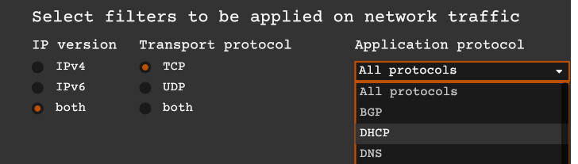
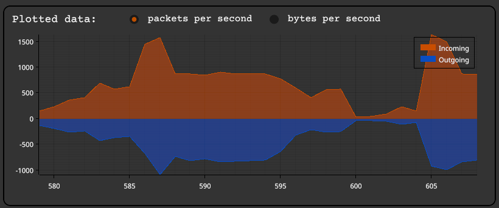
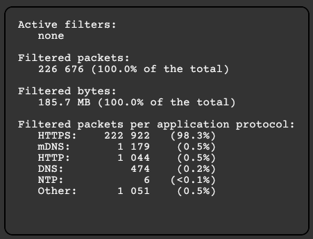
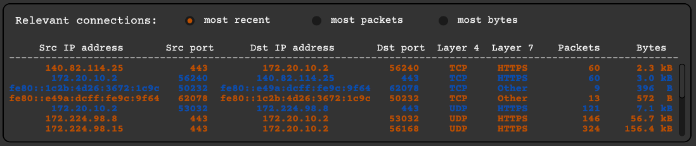

<p align="center"><a href="https://github.com/GyulyVGC/sniffnet"></a></p>


<hr>

<p align="center"> Application to comfortably monitor your network traffic </p>
<p align="center"> Multithreaded, cross-platform, reliable </p>

<p align="center">
<a href="https://crates.io/crates/sniffnet"></a>
&nbsp;
<a href="https://github.com/GyulyVGC/sniffnet"></a>
</p>


<hr>

<p align="center"></p>

<div align="center">
<p>Sniffnet is a simple yet insightful application to let you have a glance into your network traffic 
in a straightforward and appealing way </p>
</div>

<hr>


## Install & Run

If you have [Rust installed](https://www.rust-lang.org/tools/install) on your machine, the application binary can be installed with ```cargo install sniffnet```

Otherwise, you can install Sniffnet through the installers available in the [latest release](https://github.com/GyulyVGC/sniffnet/releases)


<details>

  <summary>Windows dependencies&emsp;</summary>

  In order to correctly run Sniffnet on Windows systems you need to:

  - Install [Npcap](https://npcap.com/#download).

  - Download the [Npcap SDK](https://npcap.com/#download).

  - Add the SDK's ```/Lib``` or ```/Lib/x64``` folder to your ```LIB``` environment variable.
    
</details>


<details>

  <summary>Linux dependencies&emsp;</summary>
 
  In order to correctly run Sniffnet on Linux systems, install the libraries and header files for the libpcap library: 
  
`sudo apt-get install libpcap-dev`

  Note that if you are not running as root, you need to set capabilities to inspect a network adapter: 
  
`sudo setcap cap_net_raw,cap_net_admin=eip <YOUR/SNIFFNET/EXECUTABLE/PATH>`
    
</details>


<details>

  <summary>MacOS dependencies&emsp;</summary>

  MacOS natively has all the dependencies you need to build and run Sniffnet!
    
</details>


## Features

- choose a network adapter to inspect
<p align="center"></p>

- select filters to apply to the observed traffic
<p align="center"></p>
  
- view real-time charts about traffic intensity (bytes and packets per second, incoming and outgoing)
<p align="center"></p>

- view overall statistics about the filtered traffic
<p align="center"></p>

- view most relevant connections (most recent, most packets, most bytes)
<p align="center"></p>

- save complete textual report with detailed information for each connection:
  * source and destination IP addresses
  * source and destination ports
  * carried protocols
  * amount of exchanged packets and bytes
  * initial and final timestamp of information exchange
  

## Supported application layer protocols

<details>

  <summary>See details</summary>
  
  <br>
  
  Please, note that application layer protocols are just inferred from the transport port numbers.
  
  <br>
  
<div align="center">

|Port number(s)|Application protocol  |  Description |
|--|--|--|
| 20, 21 | FTP |File Transfer Protocol |
|22|SSH |Secure Shell |
|23|Telnet |Telnet |
|25|SMTP |Simple Mail Transfer Protocol |
|49|TACACS |Terminal Access Controller Access-Control System |
|53|DNS |Domain Name System |
|67, 68|DHCP |Dynamic Host Configuration Protocol |
|69|TFTP |Trivial File Transfer Protocol |
|80, 8080|HTTP |Hypertext Transfer Protocol |
|109, 110|POP |Post Office Protocol |
|123|NTP |Network Time Protocol |
|137, 138, 139|NetBIOS |NetBIOS |
|143, 220|IMAP |Internet Message Access Protocol |
|161, 162, 199|SNMP |Simple Network Management Protocol |
|179|BGP |Border Gateway Protocol |
|389|LDAP |Lightweight Directory Access Protocol |
|443|HTTPS |Hypertext Transfer Protocol over SSL/TLS |
|636|LDAPS |Lightweight Directory Access Protocol over TLS/SSL |
|989, 990|FTPS |File Transfer Protocol over TLS/SSL |
|993|IMAPS |Internet Message Access Protocol over TLS/SSL |
|995|POP3S |Post Office Protocol 3 over TLS/SSL |
|1900|SSDP |Simple Service Discovery Protocol |
|5222|XMPP |Extensible Messaging and Presence Protocol |
|5353|mDNS |Multicast DNS |

</div>

</details>


## Troubleshooting

<details>

  <summary>See details</summary>


### Pcap permission denied error

You may incur in this error if you have not the privilege to open a network adapter. Full error is reported below.

<p align="center">  </p>

To solve this error you can execute the following command:
```sudo chown username /dev/bp*```

Where ```username``` can be retrieved with the command ```whoami```

Alternatively, you can run the application as root: ```sudo sniffnet [OPTIONS]```

In both cases you will be requested to insert your system password.


### Textual report contains just the header

If the textual output is not reporting packets statistics, make sure you are sniffing the correct network adapter (use the ```-d```
option to see the full list of your network adapters' names and addresses). 
To inspect a network adapter of your choice, remember to specify the ```-a``` option followed by the name of the adapter to be analyzed. 
If you don't include such option a default adapter is chosen by the application, but it may not be the one you expected to sniff.

Note that to see report updates while Sniffnet is running you may have to close and re-open the report file.

If you are still not able to see any packet statistic, then it probably means that you are just not receiving packets from the network: 
surf the web to receive some packets. 


</details>


## Contribute

Do you want to improve Sniffnet? Check [here](https://github.com/GyulyVGC/sniffnet/blob/main/CONTRIBUTING.md) 


## Stargazers

<a href="https://github.com/GyulyVGC/sniffnet/stargazers"></a>
