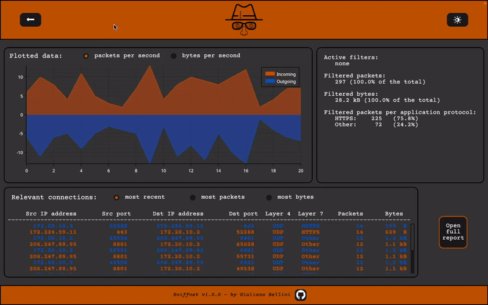

<p align="center"><a href="https://github.com/GyulyVGC/sniffnet"></a></p>


<hr>

<p align="center"> Application to comfortably monitor your network traffic. </p>
<p align="center"> Multithreaded, cross-platform, reliable. </p>

<p align="center">
<a href="https://crates.io/crates/sniffnet"></a>
&nbsp;
<a href="https://github.com/GyulyVGC/sniffnet"></a>
</p>


<hr>

<p align="center"></p>

TO BE CONTINUED.......


## Install

The application binary can be installed with ```cargo install sniffnet```

The application can then be run using ```sniffnet [OPTIONS]```


<details>

  <summary>Build on Windows&emsp;</summary>
  
  <br>
  In order to build and run Sniffnet on Windows systems you need to:

  - Install [Npcap](https://npcap.com/#download).

  - Download the [Npcap SDK](https://npcap.com/#download).

  - Add the SDK's ```/Lib``` or ```/Lib/x64``` folder to your ```LIB``` environment variable.
    
</details>


<details>

  <summary>Build on Linux&emsp;</summary>
  
  <br>
  In order to build and run Sniffnet on Linux systems, install the libraries and header files for the libpcap library. For example:

  - On Debian based Linux: ```install libpcap-dev```.

  - On Fedora Linux: ```install libpcap-devel```.

  - Note that if you are not running as root, you need to set capabilities like so: ```sudo setcap cap_net_raw,cap_net_admin=eip path/to/bin```.
    
</details>


<details>

  <summary>Build on MacOS&emsp;</summary>
  
  <br>
  MacOS natively has all the dependencies you need to build and run Sniffnet!
    
</details>


## Graphical report

<details>

  <summary>See details</summary>
  
  <br>

The graphical report consists of a svg file, constantly updated while Sniffnet is running.
It is suggested to open this file with a web browser, in order to be able to comfortably refresh it.

It reports the amount of sent (outgoing) and received (incoming) bits and packets per second.


Note that the number of bits and packets in the graph refers to one single second even if the update frequency is different.

The default update frequency is set to 5 seconds, but you can change it launching the application with the ```-i``` option.
Note that the default interval of 5 seconds is more suitable if the network traffic is constant and steady (e.g., large file download);
in case of intermittent traffic, you can consider using a lower time interval.

</details>

## Textual reports

<details>

  <summary>See details</summary>
  
### statistics.txt

This file contains details and statistics about the sniffing process.

<p align="center">
    
</p>

First, it specifies the name of the network adapter analyzed.

Then there is a detail about the initial timestamp of the sniffing process and the last timestamp in which the report was updated.

It also describes the status of the possible filters applicable by the user through the command line: IP address version, transport layer protocol, port minimum and maximum number, and application layer protocol.

Finally, it reports some statistics about the observed traffic: the number of [address:port] pairs considered, the total number
of sniffed packets, the number (and percentage) of packets selected according to the active filters and a list of the 
observed application layer protocols with the respective packets count.


### report.txt

This file contains a detailed analysis of the packets stream for each [address:port] pair.

This analysis results in a table in which each row represents an [address:port] pair with the relative statistics.

<p align="center">
    
</p>

For each [address:port] pair it is reported the amount of exchanged data measured in number of packets and in number of bytes between the source and the destination.

For each [address:port] pair are reported the first and the last timestamp in which a packet was transmitted between that [address:port] pair.

Level 4 and level 7 carried protocols are also described (respectively transport layer and application layer protocols); 
please note that application level protocols are just inferred from the transport port numbers.

</details>

## Supported application layer protocols

<details>

  <summary>See details</summary>
  
  <br>
  
  Please, note that application layer protocols are just inferred from the transport port numbers.
  
  <br>
  
<div align="center">

|Port number(s)|Application protocol  |  Description |
|--|--|--|
| 20, 21 | FTP |File Transfer Protocol |
|22|SSH |Secure Shell |
|23|Telnet |Telnet |
|25|SMTP |Simple Mail Transfer Protocol |
|49|TACACS |Terminal Access Controller Access-Control System |
|53|DNS |Domain Name System |
|67, 68|DHCP |Dynamic Host Configuration Protocol |
|69|TFTP |Trivial File Transfer Protocol |
|80, 8080|HTTP |Hypertext Transfer Protocol |
|109, 110|POP |Post Office Protocol |
|123|NTP |Network Time Protocol |
|137, 138, 139|NetBIOS |NetBIOS |
|143, 220|IMAP |Internet Message Access Protocol |
|161, 162, 199|SNMP |Simple Network Management Protocol |
|179|BGP |Border Gateway Protocol |
|389|LDAP |Lightweight Directory Access Protocol |
|443|HTTPS |Hypertext Transfer Protocol over SSL/TLS |
|636|LDAPS |Lightweight Directory Access Protocol over TLS/SSL |
|989, 990|FTPS |File Transfer Protocol over TLS/SSL |
|993|IMAPS |Internet Message Access Protocol over TLS/SSL |
|995|POP3S |Post Office Protocol 3 over TLS/SSL |
|1900|SSDP |Simple Service Discovery Protocol |
|5222|XMPP |Extensible Messaging and Presence Protocol |
|5353|mDNS |Multicast DNS |

</div>

</details>


## Troubleshooting

<details>

  <summary>See details</summary>


### Pcap permission denied error

You may incur in this error if you have not the privilege to open a network adapter. Full error is reported below.

<p align="center">  </p>

To solve this error you can execute the following command:
```sudo chown username /dev/bp*```

Where ```username``` can be retrieved with the command ```whoami```

Alternatively, you can run the application as root: ```sudo sniffnet [OPTIONS]```

In both cases you will be requested to insert your system password.


### Textual report contains just the header

If the textual output is not reporting packets statistics, make sure you are sniffing the correct network adapter (use the ```-d```
option to see the full list of your network adapters' names and addresses). 
To inspect a network adapter of your choice, remember to specify the ```-a``` option followed by the name of the adapter to be analyzed. 
If you don't include such option a default adapter is chosen by the application, but it may not be the one you expected to sniff.

Note that to see report updates while Sniffnet is running you may have to close and re-open the report file.

If you are still not able to see any packet statistic, then it probably means that you are just not receiving packets from the network: 
surf the web to receive some packets. 


</details>


## Contribute

Do you want to improve Sniffnet? Check [here](https://github.com/GyulyVGC/sniffnet/blob/main/CONTRIBUTING.md) 


## Stargazers

<a href="https://github.com/GyulyVGC/sniffnet/stargazers"></a>
